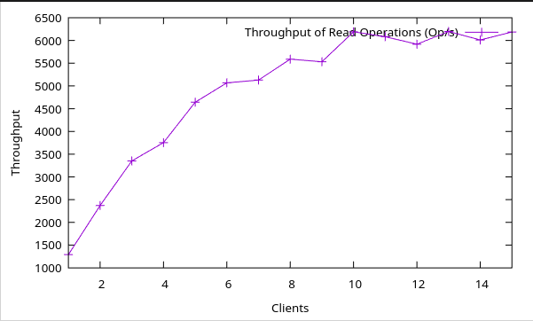
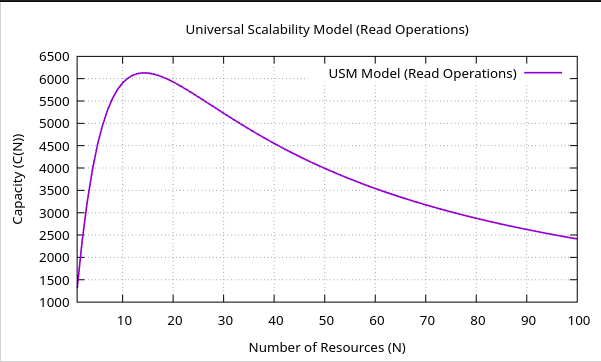

# esle24-g1

## YugabyteDB Scalability Analysis and Benchmark

### Description

<!-- Let people know what your project can do specifically. Provide context and add a link to any reference visitors might be unfamiliar with. A list of Features or a Background subsection can also be added here. If there are alternatives to your project, this is a good place to list differentiating factors. -->

This repository contains scripts, tests, and results for analyzing and benchmarking YugabyteDB's performance and scalability. The project focuses on the YSQL interface, which is designed for high performance, reliability, and strong consistency in distributed SQL databases.

#### Key Objectives

- **Benchmarking YugabyteDB**: Evaluate how YugabyteDB handles workloads that require strong consistency and partition tolerance, especially under YSQL's default transaction model—Single-row linearizable transactions and Multi-row snapshot isolated transactions (equivalent to PostgreSQL's repeatable read).
- **Scalability Analysis**: Investigate how the database scales horizontally across nodes, and examine its ability to handle bottlenecks.
  Use Case Consideration: Assess the suitability of YugabyteDB for financial applications that demand strong consistency, as well as understanding its limitations for high-throughput, write-heavy systems such as real-time meteorological data collection.

#### Contents

- **Benchmarking Scripts**: Automated tests to measure read/write throughput, latency, and scalability across various cluster sizes and configurations.
- **Test Workloads**: Simulated workloads for both single-row and multi-row transactions, providing insights into the system's consistency guarantees and performance under stress.
- **Analysis & Graphs**: Performance data visualized to show trends and bottlenecks, with accompanying analysis.
- **Configuration Files**: Sample configurations for setting up YugabyteDB clusters tailored to different scenarios.

### Installation

<!-- Within a particular ecosystem, there may be a common way of installing things, such as using Yarn, NuGet, or Homebrew. However, consider the possibility that whoever is reading your README is a novice and would like more guidance. Listing specific steps helps remove ambiguity and gets people to using your project as quickly as possible. If it only runs in a specific context like a particular programming language version or operating system or has dependencies that have to be installed manually, also add a Requirements subsection. -->

#### Local Setup

> Instructions are provided for a debian (or debian-based) operating system. The setup process may vary for other systems.

##### Run-once setup steps

1. Clone the repository:

```bash
git clone https://gitlab.rnl.tecnico.ulisboa.pt/esle/esle24-g1.git
```

2. Install dependencies:

- [Minikube](https://minikube.sigs.k8s.io/docs/start/)

```bash
# minikube stable release on x86-64 Linux
curl -LO https://storage.googleapis.com/minikube/releases/latest/minikube_latest_amd64.deb
sudo dpkg -i minikube_latest_amd64.deb
```

- [Kubectl](https://kubernetes.io/releases/download/)

```bash
sudo apt-get update
# apt-transport-https may be a dummy package; if so, you can skip that package
sudo apt-get install -y apt-transport-https ca-certificates curl gnupg
# If the folder `/etc/apt/keyrings` does not exist, it should be created before the curl command, read the note below.
# sudo mkdir -p -m 755 /etc/apt/keyrings
curl -fsSL https://pkgs.k8s.io/core:/stable:/v1.31/deb/Release.key | sudo gpg --dearmor -o /etc/apt/keyrings/kubernetes-apt-keyring.gpg
sudo chmod 644 /etc/apt/keyrings/kubernetes-apt-keyring.gpg # allow unprivileged APT programs to read this keyring
# This overwrites any existing configuration in /etc/apt/sources.list.d/kubernetes.list
echo 'deb [signed-by=/etc/apt/keyrings/kubernetes-apt-keyring.gpg] https://pkgs.k8s.io/core:/stable:/v1.31/deb/ /' | sudo tee /etc/apt/sources.list.d/kubernetes.list
sudo chmod 644 /etc/apt/sources.list.d/kubernetes.list   # helps tools such as command-not-found to work correctly
sudo apt-get update
sudo apt-get install -y kubectl
```

- [Helm](https://helm.sh/docs/intro/install/)

```bash
curl https://baltocdn.com/helm/signing.asc | gpg --dearmor | sudo tee /usr/share/keyrings/helm.gpg > /dev/null
sudo apt-get install apt-transport-https --yes
echo "deb [arch=$(dpkg --print-architecture) signed-by=/usr/share/keyrings/helm.gpg] https://baltocdn.com/helm/stable/debian/ all main" | sudo tee /etc/apt/sources.list.d/helm-stable-debian.list
sudo apt-get update
sudo apt-get install helm
```

##### Normal setup steps

3. Create the kubernetes cluster:
   > There is no need to repeat this step if you have already created the cluster (and did not destroyed it).

```bash
minikube start --memory=8192 --cpus=4 --disk-size=40g --vm-driver=virtualbox
```

4. Create a namespace and install YugabyteDB:
   > There is no need to repeat this step if you have already did this and did not unninstall (and did not destroyed it). Feel free to change the values if you know what you are doing.

```bash
kubectl create namespace yb-demo
# create 3 node cluster for yb-masters and yb-tservers services (each gets 3 different pods)
REPLICAS=3
# set to 3 the number of shards for the data stored in yb-masters and yb-tservers
SHARDS=3
helm install yb-demo yugabytedb/yugabyte --version 2.23.0 \
--set resource.master.requests.cpu=0.2,\
resource.master.requests.memory=0.3Gi,\
resource.tserver.requests.cpu=0.2,\
resource.tserver.requests.memory=0.3Gi,\
replicas.master=$REPLICAS,\
replicas.tserver=$REPLICAS,\
gflags.master.ysql_num_tablets=$SHARDS,\
gflags.tserver.ysql_num_tablets=$SHARDS \
--namespace yb-demo
```

5. Check if the pods are running:

```bash
kubectl --namespace yb-demo get pods
# Output should be similar to:

# NAME           READY     STATUS              RESTARTS   AGE
# yb-master-0    0/3     ContainerCreating   0          14s
# yb-master-1    0/3     ContainerCreating   0          14s
# yb-master-2    0/3     ContainerCreating   0          14s
# yb-tserver-0   0/3     ContainerCreating   0          14s
# yb-tserver-1   0/3     ContainerCreating   0          14s
# yb-tserver-2   0/3     ContainerCreating   0          14s

# And eventually:

# NAME           READY     STATUS    RESTARTS   AGE
# yb-master-0    3/3     Running   0          65s
# yb-master-1    3/3     Running   0          65s
# yb-master-2    3/3     Running   0          65s
# yb-tserver-0   3/3     Running   0          65s
# yb-tserver-1   3/3     Running   0          65s
# yb-tserver-2   3/3     Running   0          65s
```

### Usage

<!-- Use examples liberally, and show the expected output if you can. It's helpful to have inline the smallest example of usage that you can demonstrate, while providing links to more sophisticated examples if they are too long to reasonably include in the README. -->

#### Basic utilities

- Check Admin UI: (run and enter http://localhost:7000 in your browser)

```bash
kubectl --namespace yb-demo port-forward svc/yb-master-ui 7000:7000
```

- Check YugabyteDB Pods:

```bash
kubectl --namespace yb-demo get pods
```

- Check YugabyteDB services:

```bash
kubectl --namespace yb-demo get services
```

- Check Load Balancer services:

```bash
kubectl get svc --namespace yb-demo
```

- Connect to a tablet server: (replace `yb-tserver-0` with the name of the pod you want to connect to)

```bash
kubectl exec --namespace yb-demo -it yb-tserver-0 bash
```

- Run YSQL shell from inside of a tablet server:

```bash
kubectl exec --namespace yb-demo -it yb-tserver-0 -- /home/yugabyte/bin/ysqlsh -h yb-tserver-0.yb-tservers.default
```

- Scale service:
  > Works by simply reconfiguring the Kubernetes package.

```bash
REPLICAS=5 # considering the previous scenario, scale up to 5 nodes
SHARDS=3
helm upgrade yb-demo yugabytedb/yugabyte \
--version 2.23.0 \
--set resource.master.requests.cpu=0.5,\
resource.master.requests.memory=0.5Gi,\
resource.tserver.requests.cpu=0.5,\
resource.tserver.requests.memory=0.5Gi,\
replicas.master=$REPLICAS,\
replicas.tserver=$REPLICAS,\
gflags.master.ysql_num_tablets=$SHARDS,\
gflags.tserver.ysql_num_tablets=$SHARDS\
--namespace yb-demo
```

### Tests

Our tests were based on this [repository](https://github.com/yugabyte/yb-sample-apps) provided by the Yugabyte project.

This repository with a number of premade tests, written in Java, and [avaliable here](./yb-sample-apps/src/main/java/com/yugabyte/sample/apps). For our use case, we want to evaluate the system using two different scenarios:

1. Write intensive workload (only writes)
2. Read intensive workload (only reads)

The test that covers case 1. is [SqlWrite.java](./yb-sample-apps/src/main/java/com/yugabyte/sample/apps/SqlWrite.java), as for case 2. we have [SqlRead.java](./yb-sample-apps/src/main/java/com/yugabyte/sample/apps/SqlRead.java).

#### Automatic workload generation, running and data presentation

1. Run the `test.sh` script

- `number_of_tests_per_thread`: this corresponds to how many tests are going to be done **per thread**. The script works by consecutively running read and write tests with an increasing number of threads, until an upper bound (starting at 1). This arguments sets how many tests will be done with a certain number of threads, before incrementing it by 1.
- `time_per_test_in_seconds`: time each test takes.
- `max_number_of_write_threads`: the upper bound of the number of client threads to which write tests will be done (e.g., if set to 3, write tests with 1, 2 and 3 threads will be done)
- `max_number_of_read_threads`: the upper bound of the number of client threads to which write tests will be done (e.g., if set to 3, write tests with 1, 2 and 3 threads will be done)

```bash
./test.sh <number_of_tests_per_thread> <time_per_test_in_seconds> <max_number_of_write_threads> <max_number_of_read_threads>
```

> This script will use a a set of tools, present in this repository, that allow to automatically run tests on a local Yugabyte cluster, extrapolate data about througput and latency of the tests, and then generate graphs that allow us to evaluate the performance and potential scalability of the system. More information on how it all works [here](#structure).

#### Manual workload generation and running

1. Expose the tserver service port:

```bash
kubectl --namespace yb-demo get services | grep -e 'PORT' -e 'yb-tserver-service'
# Output should be similar to:
# NAME                   TYPE           CLUSTER-IP      EXTERNAL-IP   PORT(S)                                                                                AGE
# yb-tserver-service     LoadBalancer   10.99.177.47    <pending>     6379:32242/TCP,9042:30575/TCP,5433:31722/TCP                                           24m
```

Most likely, the port you want to port-forward is 5433. To do this, run:

```bash
kubectl port-forward svc/yb-tserver-service 5433:5433 -n yb-demo
```

2. Without terminating the port-forwarding process, on another terminal build and run the tests you want: (e.g., SqlWrite)

```bash
cd yb-sample-apps
mvn -DskipTests -DskipDockerBuild package
cd target/
java -jar target/yb-sample-apps.jar \
                        --workload SqlWrite \
                        --nodes 127.0.0.1:5433 \
                        --num_threads_write 1
```

> Notice how we can run the tests with a variety of options (`--workload`, `--nodes` and `--num_threads_write` in the above example). While the `--workload` and `--nodes` options are required, there are a number of optional parameters that can be used to customize the test.
>
> ```bash
> java -jar target/yb-sample-apps.jar --help <TEST_NAME>
> ```

### Clean-up

1. Clean-up YugabyteDB Pods

```bash
helm delete yb-demo -n yb-demo
kubectl delete pvc --namespace yb-demo -l app=yb-master
kubectl delete pvc --namespace yb-demo -l app=yb-tserver
```

2. Clean-up Minikube

```bash
# for later use
minikube stop
# (optional - recommended if not using this soon) delete the minikube cluster
minikube delete
```

### Repository Structure

This repository is divided into the following directories:

- [yb-sample-apps](./yb-sample-apps/): This folder contains a version of a workload generator created by the YugabyteDB team, modified to meet our particular use case (in essence, we added a read-only workload and a write-only workload, and modified some parameters of the tests). The original project can be found [here](https://github.com/yugabyte/yb-sample-apps).
- [test-output](./test-output/): This folder contains the raw output that was produced during an execution of a series of tests using the [yb-sample-apps](./yb-sample-apps/) tool. The output of a test usually looks something like this:

  ```json
  {
    "Read": {
      "latency": {
        "mean": 0.8624042609376477,
        "variance": 0.3960070831510931,
        "sampleSize": 127084,
        "min": 0.40515,
        "max": 147.312704,
        "p99": 1.5193423499999996
      },
      "throughput": {
        "mean": 2306.672727272727,
        "variance": 22259.187205387207,
        "sampleSize": 55,
        "min": 1902.0,
        "max": 2560.0,
        "p99": 2560.0
      }
    }
  }
  ```

- [test-parser](./test-parser/): The objective of this program, written by us, is to take the raw output produced by tests, and transform it into data that can then be used to make graphs about performance and scalibility of a system (placing this data in the [test-data](./test-data/)). It will group data from a particular test-suite in the [test-output](./test-output/) folder, and produce several files like this:

  ```csv
  #Clients Throughput
  1, 1291.6636363636362
  2, 2371.8090909090906
  3, 3351.272727272727
  4, 3753.8818181818183
  5, 4641.6
  6, 5068.481818181818
  7, 5128.99090909091
  8, 5589.527272727273
  9, 5531.64696969697
  10, 6190.9
  11, 6082.181818181818
  12, 5918.145454545454
  13, 6197.445454545455
  14, 6011.023076923077
  15, 6186.327272727272
  ```

- [test-data](./test-data/): This folder contains the files produced during the execution of the [test-parser](./test-parser/) program.
- [gnuplot](./gnuplot/): This folder contains two gnuplot files, that will generate the graphs placed into the [results](./results/) folder. The first file, [graphs.gp](./gnuplot/graphs.gp), generates **latency** and **throughput** graphs, for read and write tests (4 graphs in total). The second file, [usm.gp](./gnuplot/usm.gp) takes the parameters that are calculated using the [usm-calculator](./usm-calculator/) tool, and creates the predicted **Universal Scalability Model (USM)** for both write and read workloads, on this particular system (2 graphs).
  
  
  

  > Note: The first image corresponds to a graph generated with the `graphs.gp` file, while the second one was generated with `usm.gp` file

- [usm-calculator](./usm-calculator/): This folder contains a `.jar` file, that takes a data files present in the [test-data](./test-data/) folder, and outputs 3 parameters that are used for creating the USM.
- [results](./results/): Folder containing the generated graphs, created from a particular execution of the tests script.

### Authors and acknowledgment

| Name           | Email                                                                                 | Number |
| -------------- | ------------------------------------------------------------------------------------- | ------ |
| Beatriz Matias | [beatriz.matias@tecnico.ulisboa.pt](mailto:beatriz.matias@tecnico.ulisboa.pt)         | 95538  |
| João Sereno    | [joaohsereno@tecnico.ulisboa.pt](mailto:joaohsereno@tecnico.ulisboa.pt)               | 99249  |
| Simão Silva    | [simao.santos.silva@tecnico.ulisboa.pt](mailto:simao.santos.silva@tecnico.ulisboa.pt) | 99329  |
